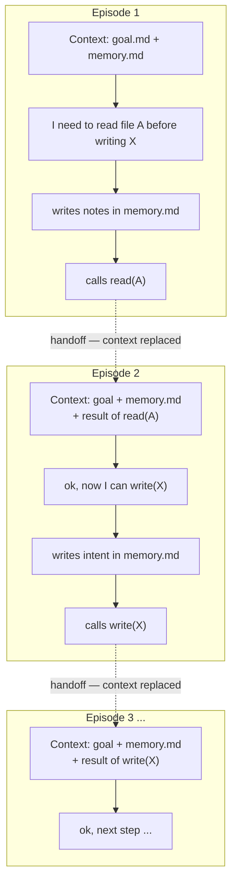

# memento — Master-Document Agent Loop

This is an attempt to solve the problem of shrinking context windows and long term tasks.  
Basically, this forces the agent to first write notes, and then replaces the context after every tool call.  
Instead of the agent seeing all previous information, the agent is presented with: 

* the goal as defined in goal.md 
* A protocol statement explaining the rules 
* It's own ___memory.md___ file
* the result of the last tool call (or calls, adjustable).  

The rules are simple.  The agent has a thinking directory, and a memory.md file.  The agent is free to read, and edit as required inside this thinknig directory.  

Before any external reaching tool call the agent must modify memory.md .  
After K (default 1) tool calls the context is replaced, and the agent must operate from its notes.  
In other words, __the agent must write its own context.__  

This does carry a penalty because the agent has to document itself as it works.  The benefit is that the agent continues work with roughly rhe same context consumed at the beginning of each turn.  (for example, a simple fastapi app took 54s with this extension and 47s without it.)

This works much better with models that are better at instruction following.  Models with poor instruction skills tend to try to write straight away, and get blocked nearly every turn.  They try to write->blocked, update memory.md , and finally write->ok.  It wastes a lot of time.  _nemotron 3.5 for example, tried to write before updating memory.md 59% of the time. Qwen3.8:27b figured out the mechanic, and wrote itself a note on how to deal with it._

It also helps greatly to have a model that understands it will be operating in a loop.  This alone is a reasoning challenge that models are not naturally prepared for.  Most models _want_ to solve problems in one-shot, but loop behavior can be established if you ask the model to do it.  

A model with stronger instruction following and reasoning realizes the nature of the loop it's in, and starts to act and plan accordingly. 

## The loop

Net effect: context stays roughly the same size at every handoff; continuity lives in `memory.md`, not the conversation.

In pi, this looks like a compaction after every tool call, but the compaction doesn't take time, it is simply rebuilding the context from goal.md and memory.md .  

## Files

- `.pi/extensions/memento/index.ts` — the whole implementation (~170 lines), loaded by project discovery
- `goal.md` — your task objective at the project root, gitignored. `.pi/goal.md` also works (legacy location); if both exist, the root one wins. Injected into every request; writes to it are blocked by tools
- `thinking/memory.md` — the agent's belief state (gitignored). Fixed sections: Plan / Facts & Decisions / Pointers / Open Questions / Next Steps. Both `thinking/` and this file are created automatically when the loop arms

## Run a task

1. Write the objective into `goal.md` at the project root (or legacy `.pi/goal.md`) — this is part of every request.  
2. Use the slash command '/memento on' then prompt something like: "Begin working toward the stated GOAL."
3. Watch for `[compaction]` markers in the TUI after external steps — each is a handoff; expand one to see exactly what future-self woke up with (goal + master.md).

## Config (env)

| Var            | Default                                  | Meaning                                                                                        |
| -------------- | ---------------------------------------- | ---------------------------------------------------------------------------------------------- |
| `MEMENTO_DIR`  | `thinking`                               | thinking dir, relative to project root                                                         |
| `MEMENTO_K`    | `1`                                      | transitions kept verbatim per handoff (an assistant message carrying tool calls + its results) |
| `MEMENTO_GOAL` | `<root>/goal.md`, fallback `.pi/goal.md` | goal file path (env override wins over both)                                                   |

## Invariants enforced by the extension

- Goal file: writes/edits blocked (`tool_call` block with reason).
- master.md: whole-file overwrite blocked — targeted edits only.
- Crossing detection is default-crossing: anything not provably inside `thinking/` counts (external paths, path-less greps/finds, all bash, web tools). Purely internal turns never hand off.
- Cuts land on assistant messages carrying tool calls, so an action/result pair is never split; if fewer than K transitions exist yet, everything from the first transition is kept.

## 

## ## Using it in another project

Copy `.pi/extensions/memento/` into that project's `.pi/extensions/` (the project must be trusted — see `~/.pi/agent/trust.json`) and give it a `goal.md` at the root (or legacy `.pi/goal.md`). Everything else is resolved relative to the project root, so each project gets its own goal + thinking dir.

Or install once globally at `~/.pi/agent/extensions/memento/index.ts` (user-level extensions skip project trust). The extension is **opt-in per project**: if neither `goal.md` nor `.pi/goal.md` exists in the working directory it registers nothing, touches nothing on disk, and logs `[memento] inactive`. Create a goal file, restart pi or `/reload`, and that project arms — which also creates its `thinking/` dir and seeds `master.md` if missing.

## Notes

- Built-in threshold compaction remains armed as the context-overflow safety net; it funnels through the same deterministic content path.
- First experiment per design §7: ~50-step stateful task, loop vs plain history, same model — track redundant calls (scored by op cost), re-derivation of known facts, recall failures, and the stale-handoff warnings above.
